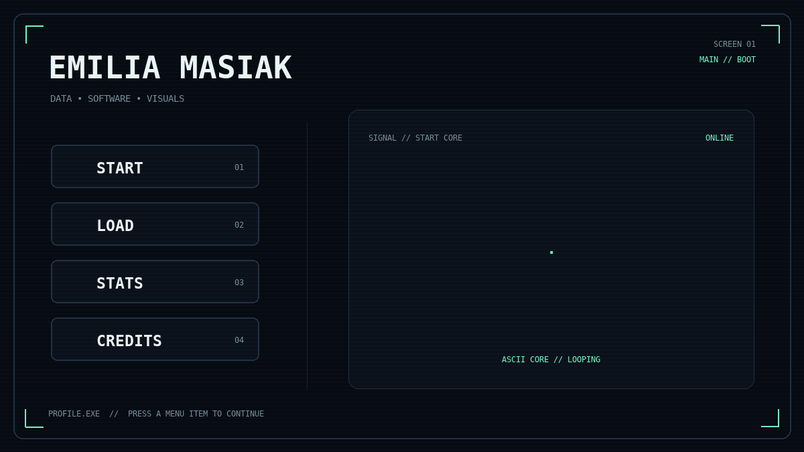
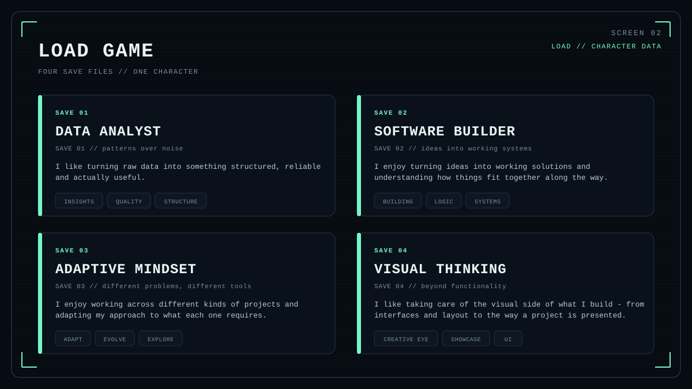
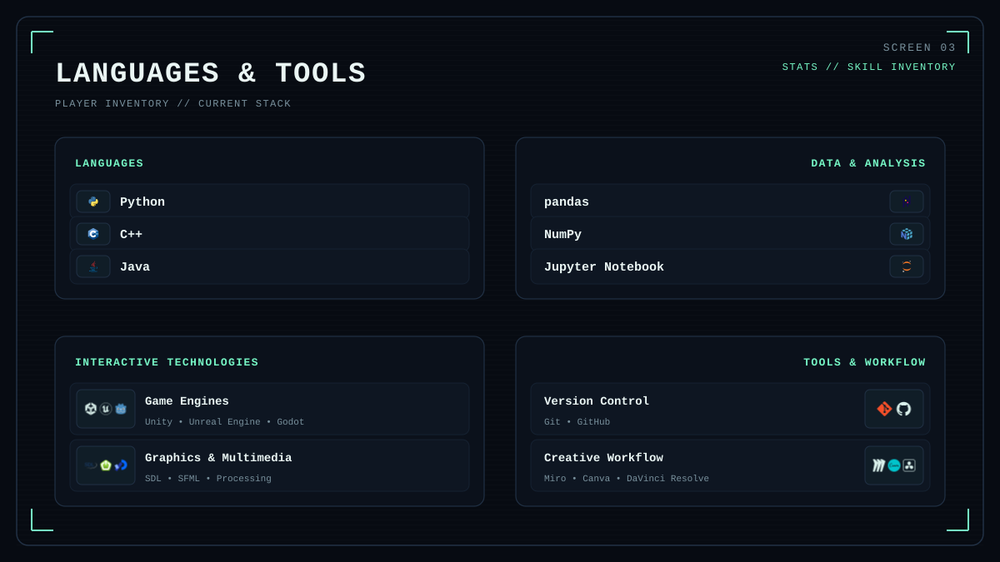
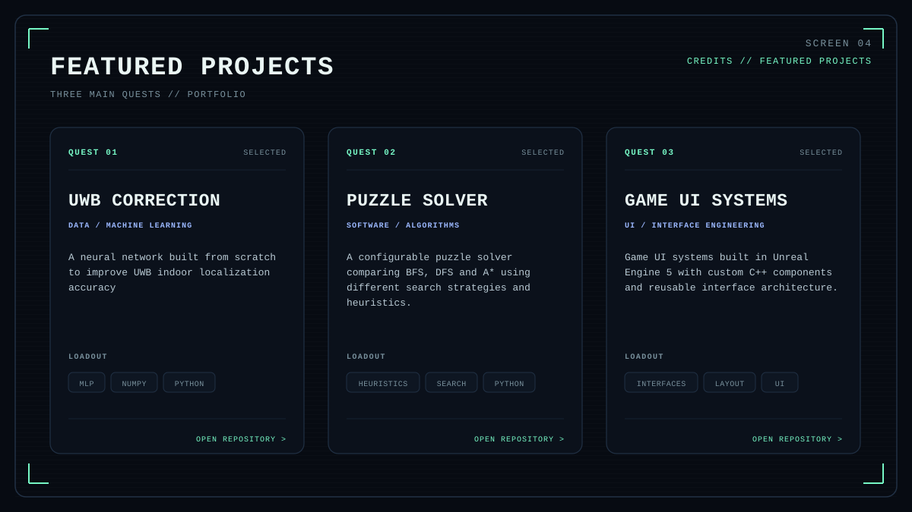

<picture>
  <source media="(max-width: 640px)" srcset="./assets/screen_main_mobile.gif">
  
</picture>

  
  
  
  

<picture>
  <source media="(max-width: 640px)" srcset="./assets/screen_load_mobile.svg">
  
</picture>

<picture>
  <source media="(max-width: 640px)" srcset="./assets/screen_tools_mobile.svg">
  
</picture>

<picture>
  <source media="(max-width: 640px)" srcset="./assets/screen_projects_mobile.svg">
  
</picture>

  
  
  

Built as a tiny game interface because programming started here with games.

